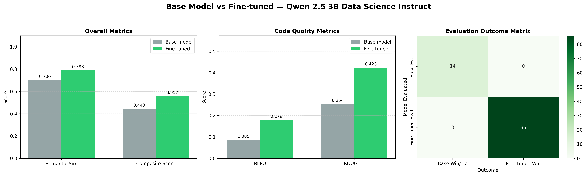
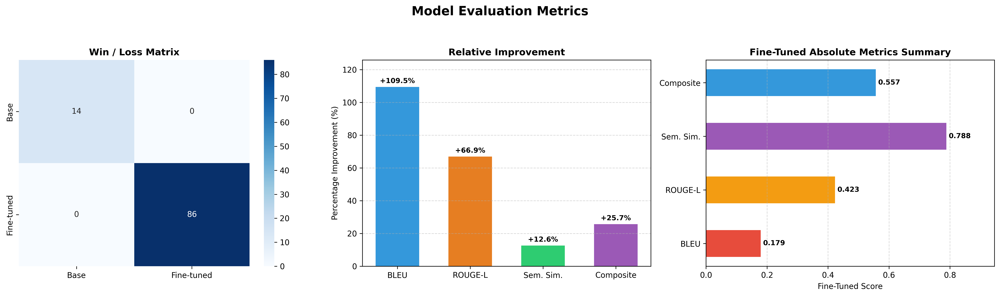

# Qwen2.5-3B Data Science Fine-tuning


This repository contains the training scripts, evaluation metrics, and comprehensive performance reports for a fine-tuned version of **Qwen2.5-3B-Instruct**, specifically adapted for **Data Science and Machine Learning coding tasks**.

By utilizing the [`ed001/ds-coder-instruct-v1`](https://huggingface.co/datasets/ed001/ds-coder-instruct-v1) dataset and the **Unsloth** library, we achieved significant improvements across all automated evaluation metrics, particularly in code generation exactness (measured by BLEU) and structural correctness (measured by ROUGE-L).

---

## Key Highlights
- **Base Model:** `Qwen/Qwen2.5-3B-Instruct`
- **Methodology:** QLoRA (4-bit quantization, Rank=16, Alpha=16) via Unsloth.
- **Dataset:** ~16.4k Data Science and ML instruct tuning examples.
- **Performance:** **86% win rate** against the base model on a held-out evaluation set of 100 examples.
- **Hardware:** Trained efficiently on a single Tesla T4 GPU in ~7.3 hours using only ~6.5 GB VRAM.

---

## Evaluation Results

Our evaluation framework compared the fine-tuned model's outputs against the base model using 100 holdout examples. The responses were measured across ROUGE-L, BLEU, Semantic Similarity, and a Composite Score.

### Overall Performance Improvement

| Metric | Base Model | Fine-Tuned Model | Absolute Change | Percentage Improvement |
|:---|:---:|:---:|:---:|:---:|
| **ROUGE-L** | 0.2535 | 0.4231 | +0.1695 | <span style="color:green">**+66.89%**</span> |
| **BLEU** | 0.0855 | 0.1791 | +0.0936 | <span style="color:green">**+109.49%**</span> |
| **Semantic Similarity**| 0.7001 | 0.7883 | +0.0881 | <span style="color:green">**+12.59%**</span> |
| **Composite Score** | 0.4432 | 0.5569 | +0.1136 | <span style="color:green">**+25.65%**</span> |

*(Note: The composite score is a weighted aggregation of the individual metrics.)*

### Visualizing the Improvements

#### 1. Base vs. Fine-tuned Comparison
This chart highlights the exact score improvements across code quality and semantic metrics, alongside a Win/Loss evaluation matrix.

<p align="center">
  
</p>

#### 2. Model Evaluation Metrics
A breakdown of the fine-tuned model's absolute performance and the relative percentage improvement over the base model.

<p align="center">
  
</p>

> **Note:** Additional deep-dive charts (heatmaps, boxplots, cumulative distributions) are available in the `results/charts/` directory!

---

## Training Details

The fine-tuning was performed using **Unsloth** for 2x faster training and significantly reduced VRAM usage.

### Hyperparameters
- **Max Sequence Length:** 2048 tokens
- **Batch Size:** 2 per device (Gradient Accumulation = 8, Effective Batch Size = 16)
- **Learning Rate:** `2e-4` (Cosine Scheduler with 20 warmup steps)
- **Optimizer:** `adamw_8bit` (Weight decay = 0.01)
- **Epochs:** 3 (687 total steps)
- **LoRA Config:** `r=16`, `lora_alpha=16`, Target modules: `["q_proj", "k_proj", "v_proj", "o_proj", "gate_proj", "up_proj", "down_proj"]`
- **Training Strategy:** Loss was masked on prompt tokens. The model only learned from the assistant's responses.

### Environment & Compute
- **GPU:** 1x NVIDIA Tesla T4 (16GB VRAM)
- **Peak VRAM:** 6.51 GB
- **Training Duration:** ~7.38 hours (442.8 minutes)

---

## Quick Start Inference

To use the fine-tuned LoRA adapter with the Unsloth library:

```python
from unsloth import FastLanguageModel
import torch

# 1. Load the base model and tokenizer
model, tokenizer = FastLanguageModel.from_pretrained(
    model_name = "unsloth/Qwen2.5-3B-Instruct-bnb-4bit",
    max_seq_length = 2048,
    dtype = None,
    load_in_4bit = True,
)

# 2. Load the fine-tuned LoRA adapter
model.load_adapter("path/to/your/lora_adapter") # Update with actual path
FastLanguageModel.for_inference(model) # Enables 2x faster inference

# 3. Prepare the prompt
prompt = "Write a Python function using pandas to handle missing numeric data."
messages = [{"role": "user", "content": prompt}]

inputs = tokenizer.apply_chat_template(
    messages, tokenize=True, add_generation_prompt=True, return_tensors="pt"
).to("cuda")

# 4. Generate!
outputs = model.generate(
    input_ids=inputs, max_new_tokens=400, temperature=0.7, top_p=0.9, do_sample=True
)

print(tokenizer.decode(outputs[0][inputs.shape[1]:], skip_special_tokens=True))
```

---

## Repository Structure

```text
├── model/                  # Destination for the final trained LoRA adapters
├── results/
│   ├── charts/             # 14 distinct performance visualizations (.png)
│   ├── report/             # Detailed CSV reports (Pairwise results, Top 20 improvements, etc.)
│   ├── base_results.csv    # Raw evaluation outputs from the base model
│   ├── finetuned_results.csv # Raw evaluation outputs from the fine-tuned model
│   └── evaluation_summary.json # High-level JSON metrics
├── scripts/
│   ├── training.ipynb      # The complete training & QLoRA pipeline notebook
│   └── evaluation.ipynb    # The benchmarking and charting notebook
└── README.md               # You are here!
```

## Caveats and Limitations

This benchmark evaluates outputs purely using automated NLP metrics (ROUGE-L, BLEU, Semantic Similarity). While a strong proxy for stylistic and semantic alignment, **these metrics do not strictly guarantee that generated Data Science code is executable, completely bug-free, or logically optimal.**

The evaluation examples are derived from the same dataset distribution used during training. To measure true real-world efficacy, evaluating the model against a genuinely unseen and out-of-distribution benchmark (with executable test cases) is recommended.

## Next Steps / Future Work
- Validate the generated Python code via direct execution (e.g., passing outputs to a Python sandbox and validating against unit tests).
- Perform ablation studies on LoRA rank (e.g., `r=32` or `r=64`) to evaluate if higher capacity yields better logic retention for complex tasks.
- Merge the LoRA adapter back into the base model and quantize it to GGUF format for localized edge inference via Ollama or `llama.cpp`.
